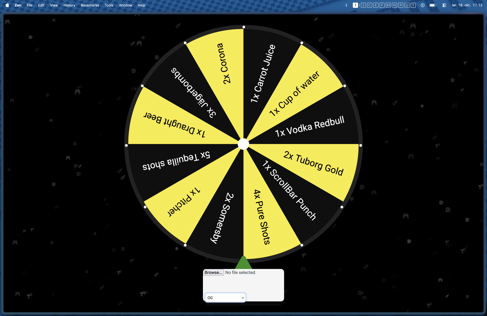

# Guidelines to Contribute

- Please checkout to a new branch when making changes.
    1. If you are working on a feature please name your new branch with the prefix `feature/`
    2. If you are fixing a bug please name your new branch with the prefix `fix/`

- Create a Pull Request to develop when ready for review. You can indicate work in progress by adding the prefix WIP or 🚧 to the PR title

# Scrollbar lykkehjul

A Pen created on CodePen.io. Original URL: [https://codepen.io/felixdq/pen/vYmypao](https://codepen.io/felixdq/pen/vYmypao).

## Change Vars

The wheel supports changing the prizes and theme during runtime.

This is achieved via two on-screen selectors, which are found by hovering below the wheel.

Screenshot of where to hover to find the selectors

The theme is changed in `script.js` (see Theming section below), whilst the prizes are loaded from a txt file where 12 lines correspond to the 12 wheel slices.

## Theming

Themes are defined directly in `script.js` in the `THEMES` object near the top of the file. Edit or add entries there to change the available themes shown in the on-screen selector.

Supported theme keys (all optional unless noted):

- `name` (string) — human readable name shown in the selector.
- `border` (CSS color) — wheel perimeter color (sets `--wheel-border`).
- `borderWidth` (CSS length, e.g. `15px`) — wheel border thickness (sets `--wheel-border-width`).
- `sliceFill` (CSS color) — primary slice color (sets `--slice-fill`).
- `sliceAltFill` (CSS color) — alternating slice color (sets `--slice-alt-fill`).
- `wheelBg` (CSS color) — background color of the wheel SVG (sets `--wheel-bg`).
- `centerFill` (CSS color) — center circle fill color (sets `--center-fill`).
- `centerRadius` (number) — center circle radius (SVG `r` attribute).
- `centerStroke` (CSS color) — center circle stroke color.
- `centerStrokeWidth` (number/string) — center circle stroke width.
- `dotFill`, `dotActiveFill`, `dotActiveAltFill` (CSS color) — colors for the decorative dots around the wheel.
- `spinButtonBg`, `spinButtonColor` (CSS color) — appearance of the spin button.
- `winTextStrokeColor` (CSS color) — stroke color used for `#winMessage` text.
- `icons` (array) — array of glyphs/characters used by the tsParticles background (can be Font Awesome codepoints or other characters).

Tips:
- To add a new theme, add a key-value pair in the `THEMES` object and then reload the page. The selector will include the new theme.
- If a theme omits a key, the loader falls back to the captured defaults so switching themes will restore unspecified values.
